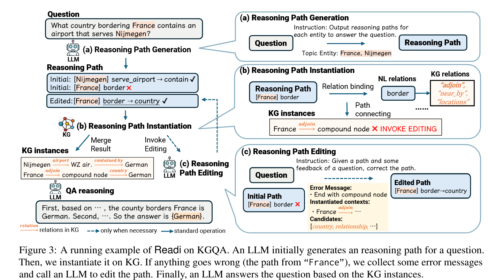
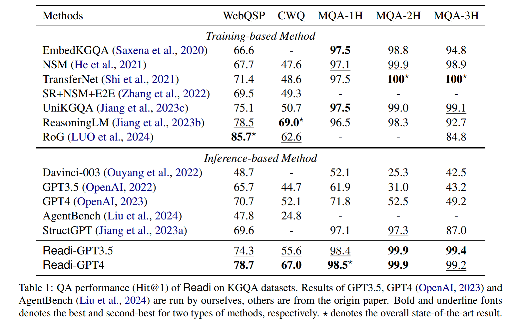

# Call Me When Necessary: LLMs can Efficiently and Faithfully Reason over  Structured Environments

## 1. 研究目标与实际问题
论文旨在提出一种交互范式，利用大语言模型（LLMs）在知识图谱中进行高效且可靠的推理，解决现有方法在处理大规模结构化环境多跳推理时存在的效率低和结果不可靠的问题。在实际应用中，像知识图谱和表格这类结构化环境包含大量数据，如何让 LLMs 准确理解自然语言问题并在其中找到答案至关重要。例如，Freebase 包含 4500 万个实体和 30 亿条事实，要在如此庞大的数据中进行多跳推理，现有方法要么效率低下，要么推理结果与结构化环境不匹配，而本文研究有助于提升LLM利用知识图谱的效率。

## 2. 方法
提出Readi框架，LLMs 先生成推理路径，再在结构化环境中实例化。若实例化过程出现问题，根据错误信息编辑路径。具体流程如下：
1. 推理路径生成。以cot方法生成多个以topic entity为起始点的初始推理路径。
2. 实例化。根据初始推理路径寻找结构化环境中存在的关系，称为实例化。根据实例化的关系。从topic entity开始，向外搜索，得到相关三元组。若推理路径中的关系无法实例化，则编辑路径。
3. 若实例化过程中出现错误，LLMs 根据错误信息编辑路径。编辑的目的是帮助大型语言模型（LLM）识别之前推理路径的错误并提供一些错误信息。错误原因分类如下：1)  初始推理路径中的关系不存在；2)  初始推理路径为空；3)  初始推理路径以复合节点结束。LLM会根据出错原因和出错位置，对原路径进行编辑。
4. 问答推理。根据推理路径搜索到相关三元组后，LLM根据这些三元组回答问题

## 3. 实验验证
**实验设计** 在知识图谱问答（KGQA）和表格问答（TableQA）两个复杂任务上进行实验，使用三个 KGQA 数据集（WebQuestionsSP、ComplexWebQuestions、MetaQA）和两个 TableQA 数据集（WikiTableQuestions、WikiSQL）。对比训练式方法（如 EmbedKGQA、NSM 等）和基于推理的方法（如 Davinci - 003、GPT3.5 等）作为基线。

**实验结果** 在 KGQA 任务中，Readi 在所有数据集上显著超越基于推理的方法和大多数训练式方法。例如在 WebQSP 数据集上，Readi - GPT3.5 的 Hit@1 准确率为 74.3%，比 Davinci - 003 高 25.6%；在 MQA - 3H 数据集上，Readi - GPT3.5 比之前的最优结果高 12.4%。在 TableQA 任务中，Readi 同样优于大多数基线方法，在 WTQ 数据集上达到了 61.7% 的表示准确率，超越了之前的最优结果。

## 4. 优势：
与逐步交互的方法相比，Readi 减少了 LLMs 的调用次数，提高了整体效率。例如，在复杂 Web 问题（CWQ）数据集上，逐步交互范式可能需要 4 - 8 次 LLM 调用，而 Readi 平均仅需 1.55 次编辑调用。与微调方法相比，Readi 不依赖大规模标注，且能保证推理结果更贴合结构化环境，在多个数据集上达到了与微调方法相当甚至更优的性能。如在 CWQ 数据集上，Readi - GPT3.5 达到了 67.0% 的 Hit@1 准确率，与微调方法效果相近，但无需大量标注。