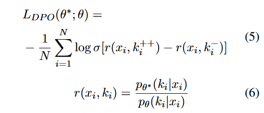

# Generate-on-Graph: Treat LLM as both Agent and KG for  Incomplete Knowledge Graph Question Answering

## 1. 论文的研究目标及实际意义
这篇论文的研究目标是解决不完全知识图谱问答（Incomplete Knowledge Graph Question Answering, IKGQA）问题。具体来说，论文提出了一种新的方法，称为Generate-on-Graph (GoG)，旨在通过结合大语言模型（LLMs）和知识图谱（KGs）来解决在不完全知识图谱下的复杂问答任务。
### 实际意义：
现实中的知识图谱往往是不完全的：由于知识图谱的构建和维护成本高昂，许多知识图谱在实际应用中存在缺失信息的问题。大语言模型（LLMs）虽然具有强大的语言理解和生成能力，但存在知识不足和幻觉问题：LLMs可能会生成不准确的信息，尤其是在缺乏外部知识支持的情况下。结合LLMs和KGs的优势：LLMs可以提供强大的语言处理和推理能力，而KGs则提供结构化的知识支持。通过结合两者，可以在不完全知识图谱下进行更准确的回答。
### 论文提出的新思路与方法
论文提出了Generate-on-Graph (GoG)方法，该方法通过Thinking-Searching-Generating框架来解决IKGQA问题。GoG的核心思想是将LLMs视为代理（Agent），通过与知识图谱的交互来动态生成缺失的知识，并逐步推理出答案。
## 2. 方法
GoG的框架分为三个主要部分：
1. Thinking（思考）：LLM根据当前的问题生成一个思考（Thought），决定下一步需要解决什么子问题或是否需要生成新的知识。
2. Searching（搜索）：LLM在知识图谱中搜索与当前思考相关的实体和关系，获取相关的子图信息。
3. Generating（生成）：如果搜索无法直接找到答案，LLM会基于已有的信息和内部知识生成新的三元组，填补知识图谱中的缺失。
## 3. 实验设计与结果
### 3.1 数据集
论文基于两个广泛使用的KGQA数据集WebQuestionSP (WebQSP)和Complex WebQuestion (CWQ)，构建了不完全知识图谱问答数据集。通过随机删除关键三元组，模拟了不同程度的知识图谱不完全性（IKG-20%/40%/60%/80%）。
### 3.2 实验设置
论文使用了多个LLM作为GoG的骨干模型，包括GPT-3.5、GPT-4、Qwen-1.5-72B-Chat和LLaMA-3-70B-Instruct。实验评估指标为Hits@1，即预测的答案在排名第一的比例。
### 3.3 实验结果
实验结果表明，GoG在不完全知识图谱（IKG）和完全知识图谱（CKG）设置下均表现出色。具体结果如下：
1. 在CKG设置下，GoG（使用GPT-4）在WebQSP和CWQ数据集上的Hits@1分别为84.4%和75.2%，显示其良好的效果。
2. 在IKG设置下，GoG（使用GPT-4）在WebQSP和CWQ数据集上的Hits@1分别为80.3%和60.4%，优于其他方法。
3. 表2中展示了不同模型在CKG和IKG设置下的Hits@1得分。GoG在大多数情况下都优于其他方法，尤其是在不完全知识图谱设置下，GoG通过生成缺失的三元组，显著提高了问答的准确性。

## 4. 论文的不足与改进空间
尽管GoG在不完全知识图谱问答任务中表现出色，但仍存在一些不足：
1. 生成过程的不可控性：LLM在生成缺失三元组时，可能会生成不准确的信息。尽管论文通过多次生成和验证来减少错误，但仍无法完全避免幻觉问题。
2. 性能提升空间：在知识图谱非常不完全的情况下（如IKG-80%），GoG的性能仍然低于使用CoT提示的LLM。这表明GoG在处理极端不完全知识图谱时仍有改进空间。
3. 实验数据集的局限性：论文的实验数据集是基于现有的KGQA数据集构建的，虽然通过随机删除三元组模拟了不完全知识图谱，但这些数据集可能无法完全反映现实中的复杂情况。

# CoTKR: Chain-of-Thought Enhanced Knowledge Rewriting for Complex  Knowledge Graph Question Answering

## 1. 论文的研究目标及实际意义
尽管LLMs在零样本场景中表现出色，但它们仍然存在事实性错误，即所谓的“幻觉”问题，尤其是在知识密集型任务（如问答系统，QA）中。这一问题的根源在于LLMs的内在局限性，包括事实不准确和知识过时。为了解决这一挑战，大量研究从外部来源检索与任务相关的知识作为上下文，从而增强LLMs在下游任务中的能力，这种方法被称为检索增强生成（RAG）。
在RAG范式下，最近的研究探索了使用知识图谱（KGs）作为信息源，以增强LLMs在问答系统（QA）中的能力。该范式下的知识图谱问答（KGQA）面临的一个关键挑战在于将问题相关的子图转换为LLMs能够理解的自然语言，同时保留结构信息。在本研究中，这一过程被称为知识重写。过去的研究存在以下局限性：
1. 冗余或遗漏。如图1所示，Triple和KG-to-Text生成的知识冗长，包含过多无关信息。摘要提供了与问题相关的总结，但试图一步组织所有相关知识。鉴于解决复杂问题所需的大量知识，这种方法可能无法涵盖所有关键信息，可能导致关键点的遗漏。
2. 语义不匹配。图1中展示的三种现有方法忽略了问题的语义，缺乏与问题推理路径一致的逻辑组织。

为了解决这些问题，论文提出了CoTKR，一种链式思维增强的知识重写方法，通过应用CoT提高知识表示的质量。该方法以交替方式生成推理轨迹和相应知识，从而生成与问题语义一致的组织良好的知识表示。
## 2. 方法
### 2.1 CoTKR
论文提出了链式思维增强的知识重写（CoTKR）方法，并将其纳入一个完整的QA框架中。该框架的核心在于知识重写器（Knowledge Rewriter），它通过两个交替进行的操作来优化知识表示：
1. 推理（Reasoning）： 将问题分解，基于生成的知识表示生成推理轨迹，并指明当前步骤所需的具体知识。
2. 总结（Summarization）： 基于当前的推理轨迹，从知识图谱中总结相关知识。

具体流程如下：
1. 初始阶段： 从知识图谱中检索与问题相关的子图（subgraph G′）。
2. 知识重写阶段： 利用CoTKR将子图转换为上下文知识，并与问题一起促使QA模型生成答案。
3. 知识表示更新： 通过推理和总结生成新的知识表示，并逐步构建全面的知识表示序列。
### 2.2 利用ChatGPT蒸馏知识的监督微调
这一阶段使开源大型语言模型（LLMs）通过监督微调初步获得知识重写能力。主要包括两个步骤：参考知识表示生成和监督微调。

受之前工作（Ma等，2023a；Wu等，2023b；Ko等，2024）的启发，论文使用ChatGPT作为数据生成器来构建训练语料库。论文通过简单的线性连接将与问题相关的子图G′进行文本化，并将其与问题q结合，形成输入提示x。随后，ChatGPT基于多个示例（即演示）和提供的输入生成参考知识表示k，以此构建训练数据集。利用来自ChatGPT的知识，对LLMs进行监督微调，以获得知识重写的能力。
### 2.3 基于问答反馈的偏好对齐（PAQAF）
在这一阶段，使用偏好对齐（PA）来弥合知识重写器与QA模型之间的偏好差距。该阶段包括四个步骤：候选知识表示采样、基于问答反馈的偏好注释、基于ChatGPT的数据增强和直接偏好优化（DPO）。

**候选知识表示采样** 输入问题q和相应的子图G′，然后从知识重写器Rθ中采样M个候选知识表示k1, k2, ..., kM。

**基于问答反馈的偏好注释** 在候选知识表示中，论文选择语义差异最大的两个，即k1和k2，以促进训练过程中的更快收敛。利用标准评估方法来评估这些表示是不理想的，因为它们无法与QA模型的偏好对齐。受之前工作的启发，论文认为更好的知识表示通常会带来更好的QA性能。因此，将k1和k2作为上下文知识，提示QA模型Q回答问题q，分别生成答案a1和a2。随后，提示ChatGPT从准确性和相关性角度评估a1和a2的质量。此评估旨在识别出优选的知识表示k+和不优选的知识表示k−。

**基于ChatGPT的数据增强** 与开源LLMs相比，ChatGPT能够生成更高质量的知识表示。因此，为了提高优选知识表示的质量并增强训练数据的多样性，使用ChatGPT对k+进行释义。在问题q、检索到的子图G′和优选知识表示k+之外，还提供了答案实体e。这使得ChatGPT能够围绕e组织相关知识，确保重写的知识覆盖关键证据。使用提示模板将问题q和文本化的子图G′连接起来，作为输入x，并使用释义后的知识表示k++和k−作为优选对，以此构建偏好数据集。

**直接偏好优化** 对知识重写器Rθ采用直接偏好优化（DPO），以开发一个偏好调整版本Rθ∗。其目标是最小化以下目标函数：

考虑到不同QA模型的偏好各异，CoTKR针对每个QA模型进行特定训练。通过这两个训练阶段，CoTKR倾向于为每个QA模型生成更为优选的知识表示k++，同时避免生成无用的知识表示k−。
## 3. 实验结果
