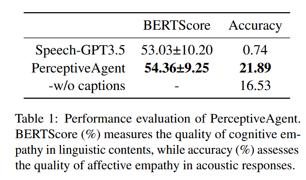
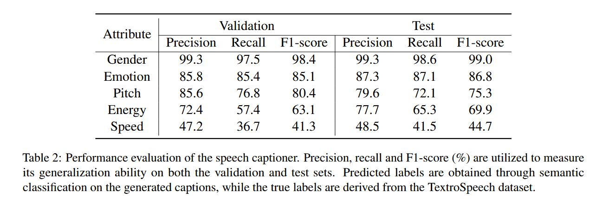
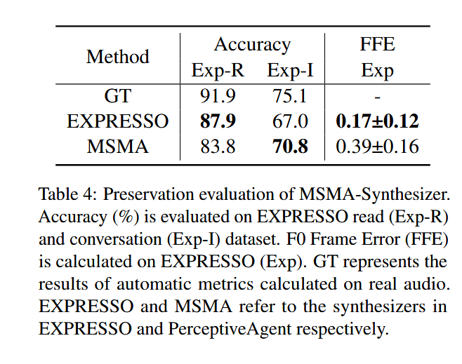

# Does it matter if empathic AI has no empathy?
source: nature machine intelligence (correspondence) 2024

本文是一篇探讨共情人工智能（AI）伦理和后果的观点类文章，由心理学家、哲学家和计算机科学家共同撰写。文章指出随着人们对共情 AI 的需求上升，其潜在风险和问题值得关注，并对为共情 AI 辩护的四种观点提出质疑。

**研究背景与问题提出** 

文化对 “与现实接触” 这一核心价值观的坚持变弱，人们对共情 AI 的使用增多。但作者团队对将 LLM 作为共情关怀来源表示担忧，并列出了一系列关于共情 AI 后果和风险的研究问题，如人们寻求共情 LLM 时是在寻找想象还是实际的陪伴、共情 LLM 幻想破灭的体验如何等。

**对为共情 AI 辩护观点的质疑:**
1. 将共情 LLM 视为想象朋友有益：人们与共情 AI 反复互动可能难以区分模拟和真实的共情，核心现实价值观可能受到威胁。例如，有研究发现共情 AI 用户会对聊天机器人产生真正的责任感。
2. 已告知人们 LLM 是模拟共情：人们体验 LLM 的 “爱” 基于自我欺骗，即便有警告，由于 LLM 的逼真性，人们仍可能陷入错觉，就像明知缪勒 - 莱尔错觉原理，但错觉依然存在。
3. LLM 幻想破灭与被人类抛弃相同：当人们发现共情 LLM 的幻想破灭时，可能会感到绝望，这与被真实的人抛弃不同，因为这意味着他们的情感寄托从未真实存在，会破坏人们判断谁真正关心自己的能力。
4. 人类人际关系中也存在欺骗：虽然人类在人际关系中也会自我欺骗，但依赖 LLM 获得共情与人类的自我欺骗有本质区别，LLM 制造的共情表达否定了对真正共情和爱的追求。

**研究总结：**

LLMs 是基于统计学习生成语言的机器学习算法，无法真正感受共情。未来是否有真正共情的 AI 尚不明确，但有能力关怀的存在也应具备撤回关怀的能力，否则会造成情感束缚，影响真正关系的建立。

# Large Language Models and Empathy: Systematic Review
source: JOURNAL OF MEDICAL INTERNET RESEARCH 2024

## 1. 论文的研究目标及实际意义
**研究目标：**
这篇论文旨在系统性地回顾和分析大模型在共情方面的表现，特别是在医疗领域的应用。具体来说，研究团队通过文献综述，评估了LLMs在识别情感、提供情感支持等方面的能力，并探讨了这些模型是否能够在医疗场景中模拟人类的共情行为。

**实际问题：**
共情是医疗领域中医生与患者沟通的核心要素，能够显著提升患者的满意度和治疗依从性。然而，LLMs作为人工智能模型，通常被认为缺乏共情能力。论文试图回答的问题是：LLMs是否能够在某些情境下表现出共情，尤其是在医疗场景中，是否能够替代或辅助医生进行情感支持。

**重要意义：**
随着LLMs在医疗领域的广泛应用（如电子病历处理、患者问答等），理解其共情能力对于提升患者体验、减轻医生负担具有重要意义。如果LLMs能够在某些情境下表现出共情，这将为AI在医疗领域的进一步应用提供新的可能性。

## 2. 论文调研的研究及其特点
论文分析了2023年发表的12项研究，主要围绕ChatGPT-3.5和其他LLMs（如GPT-4、LLaMA等）在共情任务中的表现。这些研究的特点包括：

**研究场景聚焦于医疗场景：**评估LLMs在患者问答、情感支持等方面的表现。例如，Webb（2023）使用ChatGPT模拟急诊室中的坏消息传递，发现其能够有效应用SPIKES框架（一种用于传递坏消息的医疗沟通框架）。

**评估方法：**研究使用了多种评估方法，包括自动评估指标（如ROUGE和BLEU）和人类主观评分。例如，Ayers等人（2023）比较了ChatGPT和医生在回答患者问题时的表现，发现ChatGPT的回答在78.6%的情况下被患者认为更有共情性。

## 3. 论文总结的结论
论文通过分析12项研究，得出以下主要结论：

**LLMs表现出认知共情能力：** LLMs能够识别情感并提供情感支持，特别是在医疗场景中表现出色。例如，ChatGPT在回答患者问题时，其回答被认为比医生的回答更具共情性。

**LLMs在某些任务中超越人类：** 部分研究发现，LLMs在共情任务中的表现甚至优于人类。例如，Elyoseph等人（2023）使用情感意识量表（LEAS）评估ChatGPT的情感意识，发现其得分显著高于普通人群。

**LLM的局限性：** 尽管LLMs表现出一定的共情能力，但仍存在局限性，如重复使用共情短语、对提示的敏感性、以及主观评估的偏差。

## 4. 展望
结合当前学术理解，未来在该研究方向上还有以下几个值得探索的问题和挑战：

**情感共情 vs. 认知共情：** 目前的研究主要集中在认知共情（理解他人情感），而情感共情（体验他人情感）尚未得到充分研究。未来的研究可以探索LLMs是否能够模拟情感共情。

**跨文化共情：** LLMs的共情表现可能受到文化背景的影响。未来的研究可以探讨如何使LLMs在不同文化背景下提供更具适应性的共情回应。

**评估标准的统一：** 目前的研究大多依赖主观评估，缺乏统一的评估标准。未来可以开发更客观的评估工具，以便更好地比较不同模型的共情能力。

# Talk With Human-like Agents: Empathetic Dialogue Through Perceptible  Acoustic Reception and Reaction
## 1. 研究目标、实际问题与意义
**研究目标：** 论文旨在解决当前多模态对话系统（multi-modal dialogue systems）忽视语音声学信息的问题，提出了一种结合声学感知的共情对话系统PerceptiveAgent。其核心目标是通过整合语音模态的感知能力，生成更贴近人类情感和意图的对话响应。

**实际问题：** 现有系统主要依赖文本信息，忽略语音中的声学特征（acoustic features）（如语调、语速、能量等），导致对说话者真实意图的误判。例如：“当语言的字面含义与说话者真实情感相矛盾时，系统可能生成不一致的回应”（图1案例）。

**意义：** 提升对话系统的共情能力（cognitive empathy和affective empathy），可显著改善人机交互体验，应用场景包括心理辅导、虚拟助手和社交机器人等。

## 2. 方法

1. 语音字幕模型（Speech Captioner）：

    将语音的声学特征转化为自然语言描述（如“高音调、低能量”）。

    使用ImageBind编码语音，结合Q-Former对齐声学与文本特征，通过GPT-2生成描述。

    特点：首次实现声学信息的自然语言表达，为LLM提供更丰富的上下文。

2. LLM作为认知核心：

    输入为“文本内容+声学描述”，输出为响应内容及语音风格指令。

    使用GPT-3.5-Turbo，通过提示工程（附录A）引导模型关注情感意图。

3. MSMA-Synthesizer：

    多说话者多属性语音合成器，支持对音高（pitch）、语速（speed）、能量（energy）的精细控制。

    基于HiFiGAN，结合离散语音单元（discrete speech units）和属性标签生成语音。

**关键创新：** 声学信息与自然语言的桥接，例如通过字幕捕捉“低沉的嗓音”（图3案例），避免单纯依赖文本导致的误判。

## 3. 实验设计与结果
**实验设计：**
- 数据集：训练：TextrolSpeech（23.6万语音-描述对）、EXPRESSO（带属性标签的语音）。

- 评估：MELD（含真实场景噪声的双人对话）。

- 基线对比：与仅用文本的Speech-GPT3.5对比。

- 评估指标：

    - BERTScore（语义相似度）、情感分类准确率（affective empathy）。

    - FFE（F0 Frame Error）：衡量音高保留能力。

**关键结果**
- 与基线模型Speech-GPT3.5（仅依赖文本）相比，PerceptiveAgent的BERTScore提升（54.36% vs. 53.03%），情感准确率显著提高（21.89% vs. 0.74%）。
- 语音字幕模型在性别和情感预测上表现最佳（F1-score分别为99.0%和86.8%），但语速预测较差（44.7% F1），因训练数据分布不均衡（60%样本标记为“中性”）。
- MSMA-Synthesizer在对话场景（Exp-I）中情感准确率优于基线（70.8% vs. 67.0%），但音高误差（FFE=0.39）高于纯合成方法（FFE=0.17）。

## 4. 未来研究方向
多语言支持：目前仅支持英语，需扩展至其他语言（需调整MSMA-Synthesizer）。

实时性优化：系统级联导致延迟累积，需优化模型推理效率。

复杂声学环境：当前模型无法识别背景噪声和说话者身份，需增强鲁棒性。

技术与投资机会
情感计算（Affective Computing）：结合视觉模态（如面部表情）进一步提升共情能力。

边缘计算部署：低延迟语音处理硬件可能成为投资热点。

## 5. 论文不足与改进空间
**局限性**
- 数据集限制：依赖人工标注的声学描述，无法覆盖真实场景的多样性。
- 评估偏差：仅用自动指标（如BERTScore），缺乏真实用户交互反馈。
- 技术细节不足：未深入分析声学特征提取的错误模式（如为何男性语音预测更优）。

**需验证的问题：**
- 泛化能力：模型在嘈杂环境或多轮长对话中的表现。
- 伦理风险：情感误导的可能性（如系统过度解读负面情绪）。

