# Reflection on Knowledge Graph for Large Language Models Reasoning
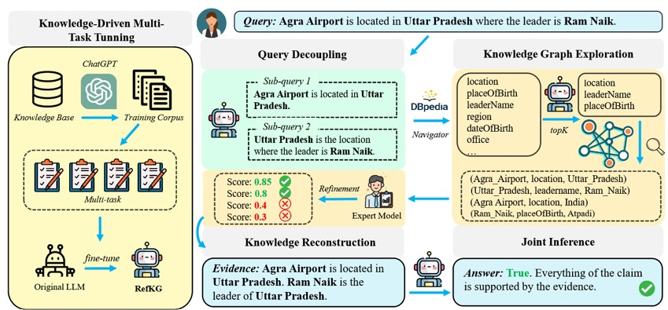
## 动机：
用传统方法从知识图谱查询到的知识容易包含噪声，需要一种方法能更好的评估并精炼知识
## 方法：
本文提出RefKG，该模型包含三个处理步骤：

### 1）查询分解：
将多跳查询分解为多个单跳查询，并且提取每个单跳查询的topic entity。
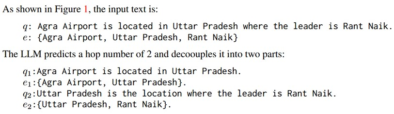
### 2）知识图谱检索和精炼：

**子图检索**：用大模型检索出Top-k个关系，由topic entity检索包含Top-k关系和topic entity的子图

**知识精炼**：训练MLP对关系进行评分，保留高于预设阈值的关系
 
### 3）用重构的知识推理：
将三元组重构成自然语言，作为证据输入大模型

**多任务微调**：通过GPT对数据进行标注，再针对Decoupling, Retrieval和Evidence Generation三项任务对大模型进行微调。
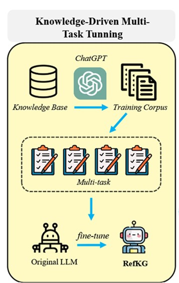
## 实验：
1. 对不同大模型进行微调，性能均大幅超过微调前，同时高于对比模型中最佳的GEAR
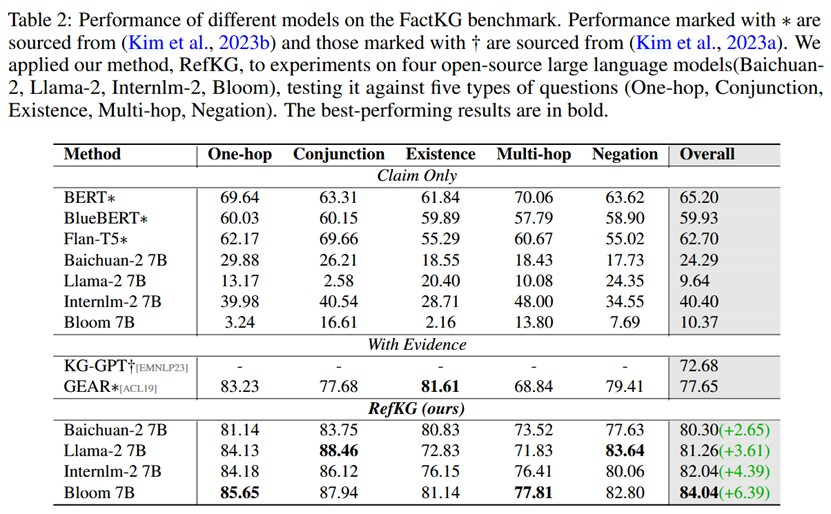
2. 在WebQSP和MetaQA数据集上的实验表明RefKG效果良好
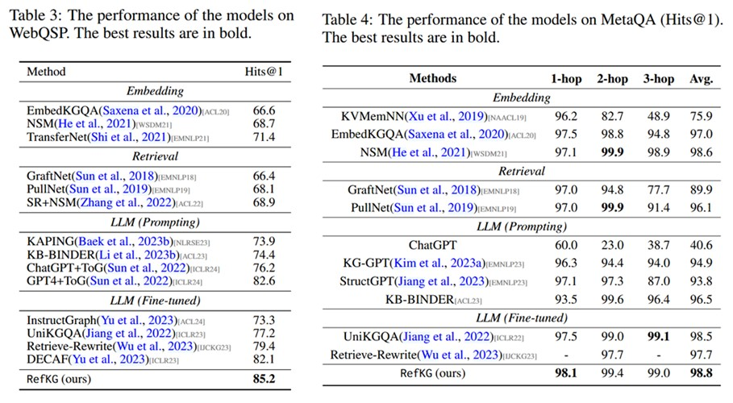
3. 通过消融实验发现，将三元组转化为文本形式对推理有很大帮助
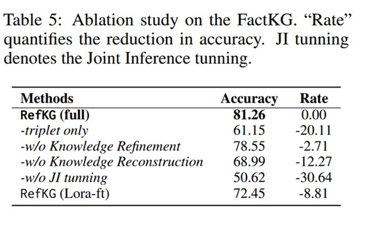
4. 增加Top-k数量对Llama的作用是负面的，但对Bloom是正面的
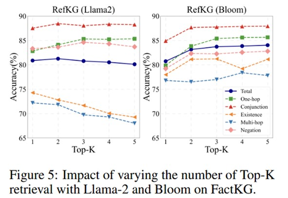
# Think-on-graph 2.0: Deep and faithful large language model reasoning with knowledge-guided retrieval augmented generation

## 动机：
基于文本的RAG无法从文本发现知识的关联，而基于知识图谱的RAG存在知识图谱不完整的问题，现有的混合RAG又没有有效结合使用两部分知识进行检索。因此，基于Think-on-Graph的研究，Think-on-Graph 2.0研究能同时利用知识图谱和文档解答问题的模型，该模型可以用文档知识增强在知识图谱上的检索。
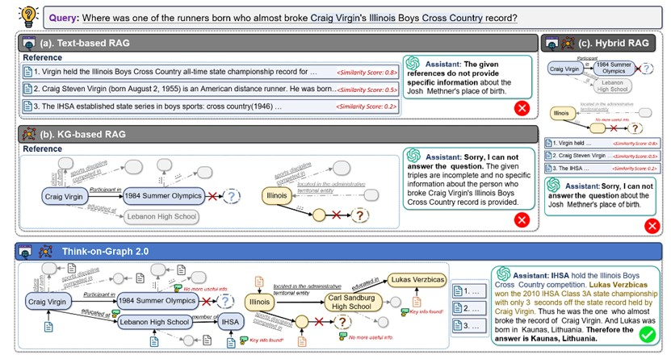
## 方法：
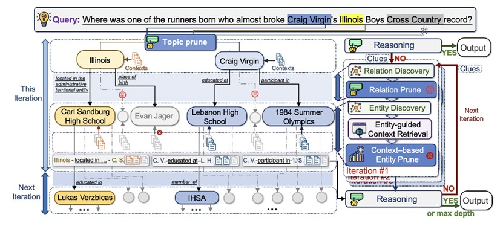
### 1. Topic prune：
由大模型根据问题和其中的实体筛选topic entity

### 2. 知识指引的图检索：
Relation Discovery：提取topic entity的邻接关系

Relation Prune：用大模型对提取的关系进行打分并筛选

Entity Discovery：提取与topic entity相连的、以上一步筛选的关系相连的实体。

### 3. 知识指引的上下文检索

**Entity-guided Context Retrieval**：使用dense retrieval models(DRMs)判断尾部实体文档资料与问题的相关分数，其中会被转化为自然语言与尾部实体的文档资料相连

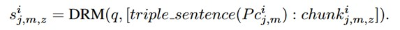

**Context-based Entity Prune**：根据相关分数计算该尾部实体与问题的相关度，选择分数较高的尾部实体作为下一轮迭代的topic entity加入推理路径
### 4. 推理：
将问题、当前轮次得到的推理路径、文档资料和上一轮生成的Clue(对当前资料是否足够的分析)输入大模型：
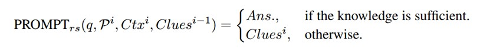
## 实验：
1）实验结果显示ToG-2的性能高于其他模型：
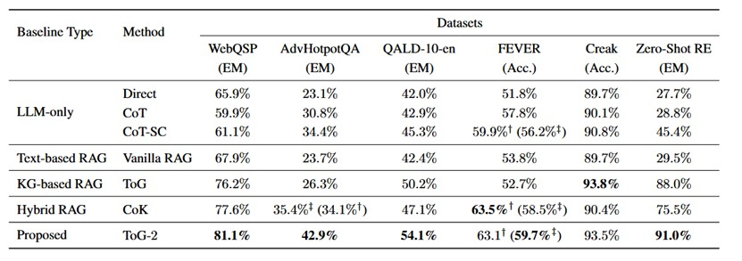
2）构建ToG-FinQA检验模型解决涉及训练时未接触数据问题的能力，测试显示ToG-2表现高于其他模型

3) 实验发现，大模型依赖文档解决的问题最多（根据大模型返回的clue进行判断）

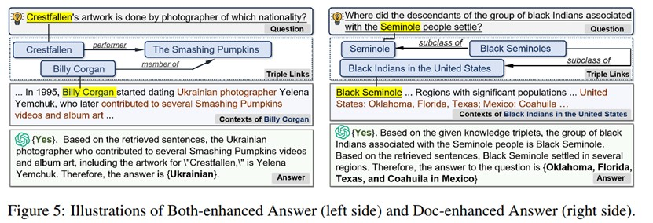
 
# FiDeLiS: Faithful Reasoning in Large Language Model for Knowledge Graph Question Answering
## 方法：
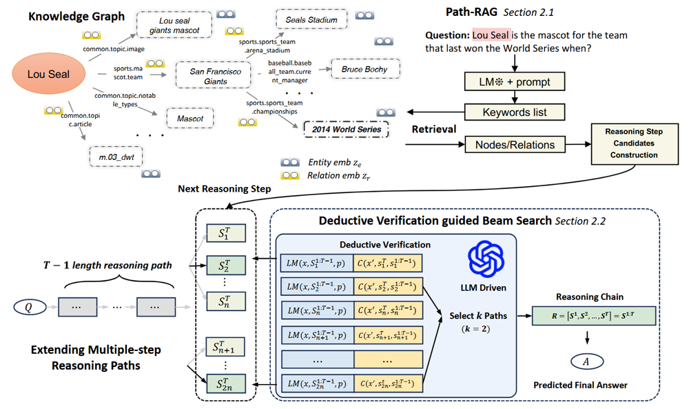
本文构建的模型FiDeLis包含两个重要结构：Path-RAG和Deductive Verification guided Beam Search(DVBS)，迭代使用两个结构处理问题

### 1. Path-RAG：

1）通过大模型从问题中提取关键词

2）从知识图谱中检索与关键词最语义相关的实体和关系:

计算初始嵌入：
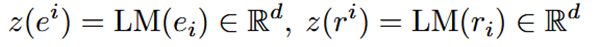
将关键词连接得到K，计算实体、关系与K的相似度，取top-m的实体和关系：

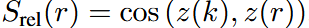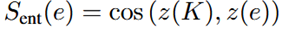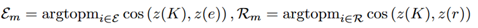
 
3）计算关系-实体对的分数，选择得分高的关系-实体对进入DVBS阶段

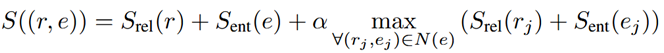
### 2. DVBS:

1）大模型提出推理计划

2）基于Beam Search拓展推理路径

用大模型判断推理步s（即关系-实体对），其中w为大模型生成的推理计划。

由大模型直接决定属于top-k的推理路径：
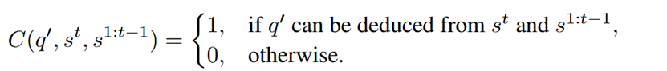
3）对现有推理路径进行评估，判断是否应该结束推理
大模型判断是否应停止推理，其中q’是问题的陈述形式。大模型需要判断由当前推理路径是否能推导出q’：
 
## 实验：
1）实验结果显示模型在使用gpt-4时达到sota，在使用gpt-3时也在多数情况下超过其他模型
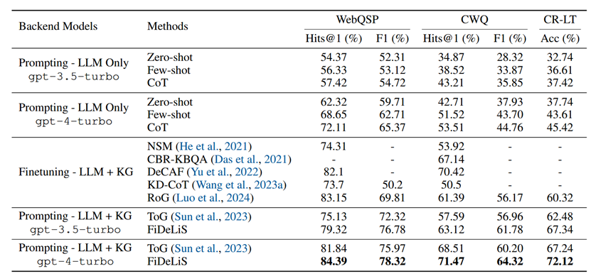
2）消融实验表明，Path-RAG和DVBS都具有显著作用，其中beam search影响最大
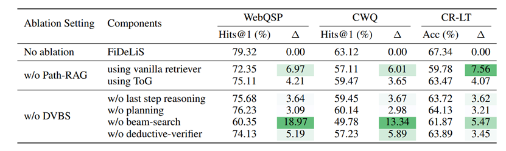
3）针对效率的实验表明，使用Path-RAG能有效降低运行时间和消耗token数，使用GPT-4o和GPT-4o-mini效果更好

# ToG-I: Progressively instructed knowledge graph-based large language model reasoning
## 动机：
目前的技术主要是从 KG 中检索显性知识，再让LLM直接使用检索到的具体事实和关系构建推理链来回答问题。然而，在处理涉及逻辑推理或模棱两可意图的问题时，这些方法往往忽视了理解隐含知识的重要性。这可能会导致推理路径出现偏差。
## 方法：
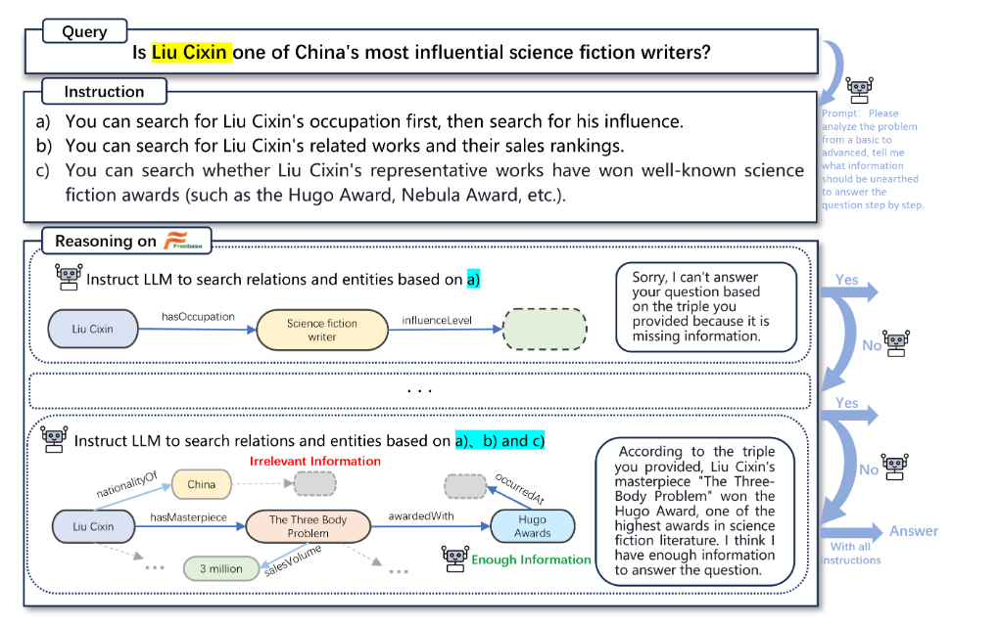
### 1. Instruction Generation
用大模型生成几个与回答问题的事实有关的指令
### 2. Instruction-based Graph Exploration
每第t次迭代，大模型根据前t条指令探索实体和关系，也就是探索指令中的涉及的实体和关系在知识图谱中的对应实体和关系，并保留大模型选择的Top-k路径。在每次迭代结束后判断当前获得知识是否足以回答问题

## 实验

1）该实验没有与同类型的模型进行对比，因此无法判断效果是否优于其他使用大模型检索知识图谱的模型
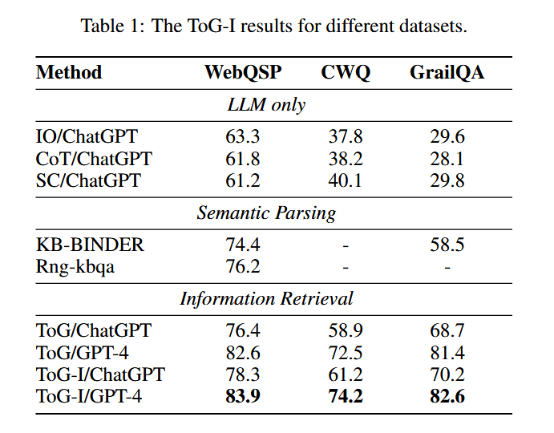

2）实验尝试了不同指令数，发现指令数为3时效果最好
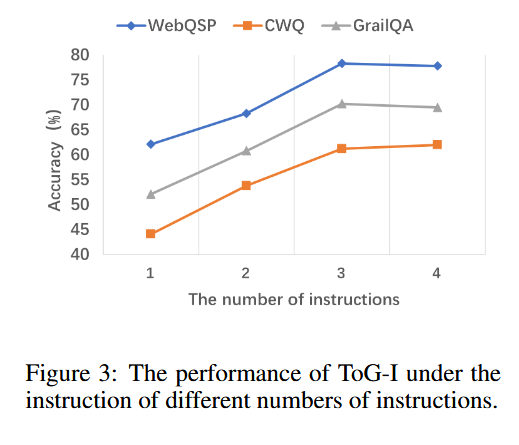

3）实验发现，多数情况下第一次迭代即可产生结果，但没有给出迭代次数与正确率的关系
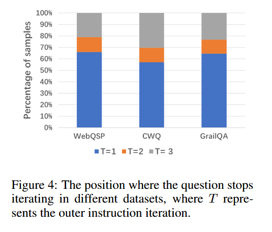

# Ger: Generation, evaluation and reflection enhanced LLM for knowledge graph question answering
## 动机：
现有的方法忽视了大模型中由大量知识图谱中不相关信息引起的幻觉放大。这种疏忽导致答案包含看似正确但不相关的回答，从而降低了可靠性。
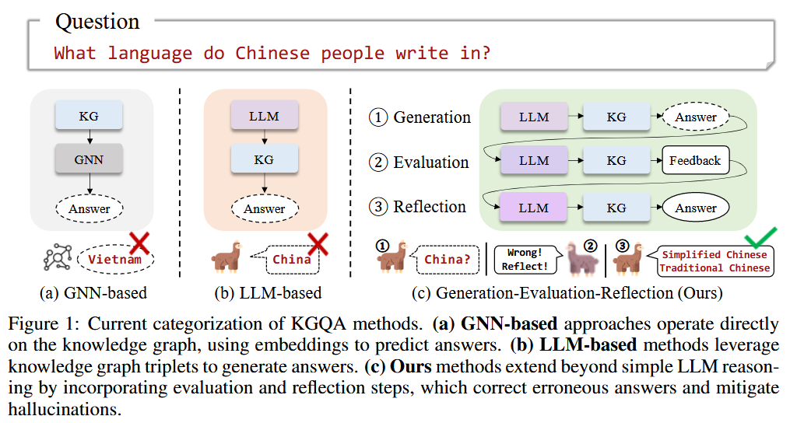
## 方法：

**1. Generation**

直接让大模型生成问题可能的推理路径，并检索推理路径在知识图谱中对应的三元组，利用检索到的三元组再让大模型生成候选答案

**2. Evaluation**

为了防止遗漏答案并尽可能识别幻觉，模型使用了两个粒度级别的评估方法：

Question-level Evaluation：将问题、所有候选答案和所有候选答案对应的知识图谱三元组输入大模型，让大模型判断答案的可靠性。这是为了评估答案整体的可靠性，并检查是否有遗漏

Answer-level Evaluation：将问题、单个候选答案和该候选答案对应的知识图谱三元组输入大模型，让大模型判断答案的可靠性。这是为了检验推理过程和答案中是否存在幻觉

**3. Reflection**

根据问题、评价结果、检索到的三元组和候选答案全部输入大模型，产生最终答案（答案可能不在候选答案中）

## 实验：
1）实验结果显示，该模型在两个数据集上表现优于其他模型
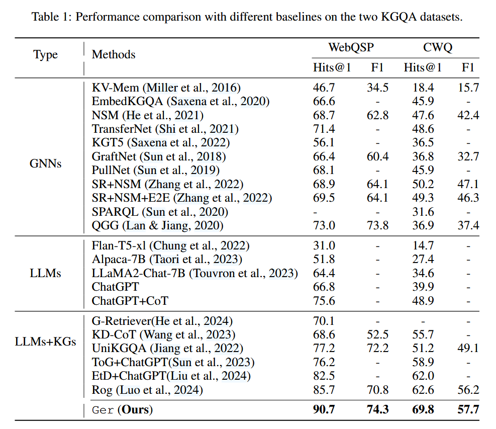

2）case study：论文举了两个例子说明evaluation对于抑制幻觉的重要性，其中左图检测到幻觉产生的错误答案，右图检测到遗失的正确答案
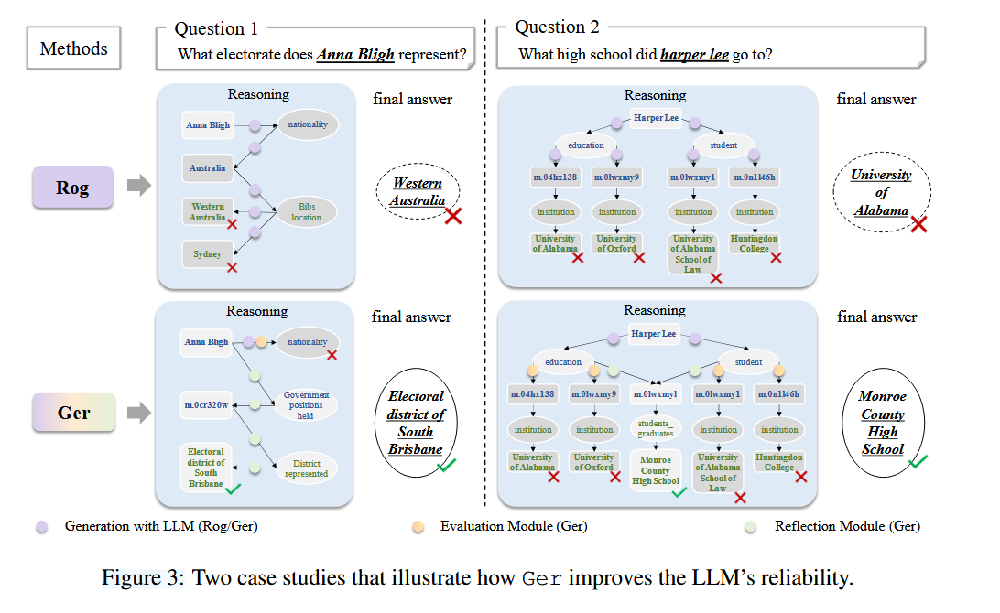

# GIVE: Structured reasoning with knowledge graph inspired veracity extrapolation

## 动机：

大模型缺少针对特定领域的训练数据，导致在处理特定领域的问题时表现不佳。另外，大模型缺乏生成多步推理链的能力。因此，希望构建模型能利用外部知识图谱激发大模型寻找概念间联系的能力

## 方法：

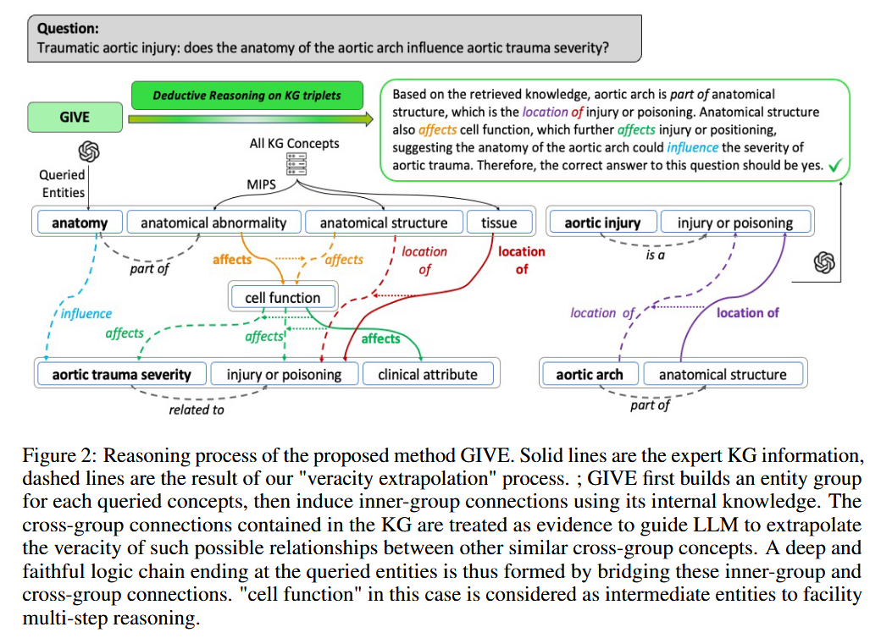

1） 使用大模型提取问题中的实体和关系。

2） 通过比较语义相似度从知识图谱中检索与1）中提取实体语义相似的实体，每个1）中提取的实体和与其语义相似的知识图谱中的实体构成一个实体组。

3） 使用大模型生成实体组中实体间的关系

4） 从知识图谱中检索不同实体组的两实体间的关系。

5） 从知识图谱中检索不同实体组的两实体间的中间实体。

6） 判断关系可信度：若关系来自知识图谱，则可信度标签为“yes”，否则由大模型判断可信度标签，（可给出的标签为"yes", "maybe", "no"）

7） 让大模型自己发现未出现在问题或知识图谱中的节点间的关系

8） 让大模型基于检索和发现的实体与关系生成答案

## 实验：

1）实验结果表明，该模型在三个数据集上表现优于其他模型

2）实验发现，当实体组包含2个KG实体时模型表现最好
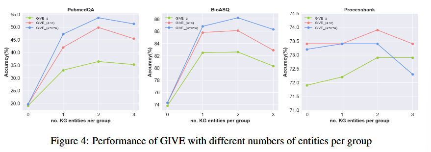