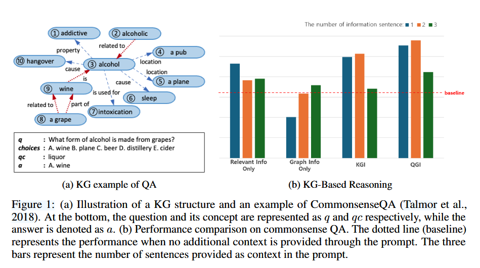
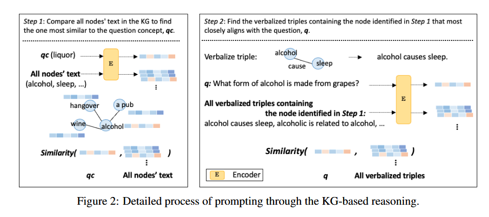
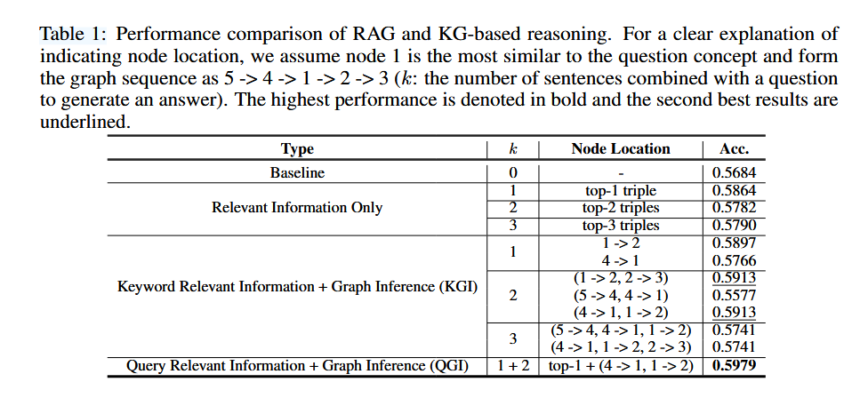

# Causal Reasoning in Large Language Models: A Knowledge Graph Approach

## 1. 研究目标
这篇论文的研究目标是探索如何通过知识图谱和因果推理来提升大语言模型在常识问答任务中的表现。具体来说，论文试图回答以下问题：在提升LLM性能时，语义信息检索和推理能力增强这两种策略中，哪一种更为重要？或者是否需要将两者结合使用？

常识问答任务要求模型不仅能够理解问题的表面含义，还需要具备深层次的推理能力，能够从常识知识中提取相关信息并做出合理的推断。这一任务的重要性在于，它直接反映了模型在处理复杂、开放性问题时的能力，尤其是在需要结合多源信息和逻辑推理的场景中。

## 2. 研究思路

论文提出了一种基于知识图谱的随机游走推理方法，通过利用知识图谱中的因果关系来增强LLM的推理能力。具体来说，该方法通过从知识图谱中提取实体和关系，构建一个推理路径，并将这些路径转化为自然语言形式的提示，输入到LLM中，从而帮助模型更好地理解问题并生成准确的答案。

随机游走：选定知识图谱中一个实体为锚点，随机选定一个邻居实体为下一步到达的节点，以此类推，直到达到设定的游走步数。实验中设定的游走方式为5 -> 4 -> 1 -> 2 -> 3，其中1为锚点，4与1之间是入边，1与2之间是出边。

与传统的检索增强生成方法相比，该方法不仅依赖于语义相似性检索，还通过知识图谱中的结构化信息进行推理。这种结合了信息检索和因果推理的方法，能够更好地处理需要复杂推理的常识问答任务。传统的RAG方法主要依赖于语义相似性检索，而本文提出的方法通过知识图谱中的因果关系进行推理，能够更深入地理解问题。通过随机游走策略，模型可以从知识图谱中提取出与问题相关的多条推理路径，增加了信息的多样性和丰富性。该方法在零样本（zero-shot）设置下进行实验，无需对LLM进行额外的训练或微调，展示了其在实际应用中的便捷性。

## 3. 实验设计及结果分析
论文通过在CommonsenseQA数据集上的实验来验证所提出方法的有效性。实验设计了四种不同的提示设置，分别考察了仅提供相关信息（直接使用与问题语义最相关的三元组）、仅提供图信息（与问题无关的三元组，但能体现连续推理过程）、关键词相关信息+图推理（KGI）以及查询相关信息+图推理（QGI）对模型性能的影响。

表1中的实验结果表明，QGI表现最佳，准确率达到了59.79%，超过了仅依赖语义检索的RAG方法。此外，图1(b)的“仅提供图信息”的实验结果显示，即使提供看似无关的信息，只要这些信息是通过因果推理提取的，模型的性能也会有所提升（随着information sentence的增加，正确率也会增加，尽管这些information sentence与问题无关）。

## 4. 论文的不足与存疑
1. 因果推理的局限性：虽然随机游走策略能够提取出一些因果关系，但其推理能力仍然有限，尤其是在处理复杂的多步推理时，可能会出现信息丢失或推理错误的情况。随机游走策略在提取信息时会忽略与问题相关的因果关系，导致模型在处理复杂问题时出现推理错误。

2. 无关信息的影响：实验中发现，即使提供无关信息，模型的性能也会有所提升，这一现象需要进一步研究和解释，以确保模型的推理过程是可靠的。

